# Interview Track architecture

This document describes the architecture of Interview Track, including the
system boundaries, application layers, relational data model, request flows,
mutation behavior, audit strategy, deployment topology, security considerations,
and scalability options.

## 1. System context

Interview Track is a full-stack Next.js application backed by Neon PostgreSQL.

The browser does not communicate directly with PostgreSQL. All reads and
mutations pass through the Next.js server runtime.

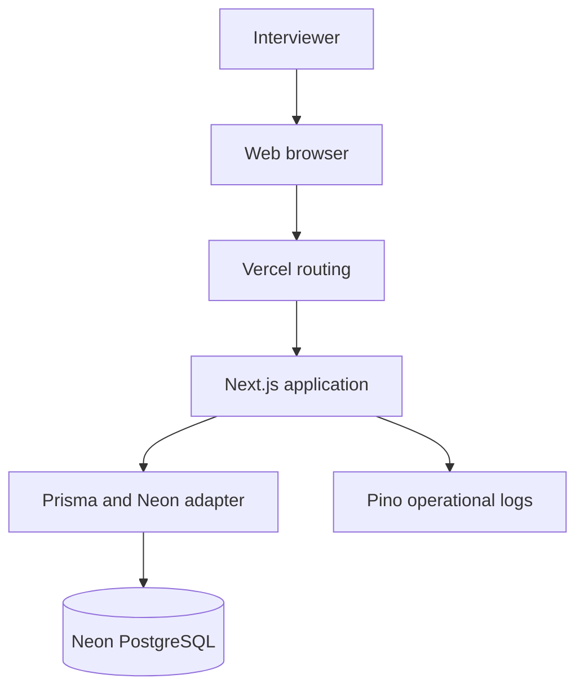

### Main responsibilities

| Component | Responsibility |
| --- | --- |
| Browser | Render the UI and handle user interaction |
| Next.js App Router | Routing, Server Components, loading states and metadata |
| Client Components | Forms, dialogs, filtering, sorting and pagination |
| Server Components | Page-level data loading and server-rendered output |
| Server actions | Validation, business rules and database mutations |
| Prisma | Typed relational database access |
| Neon PostgreSQL | Persistent application and audit data |
| Pino | Structured operational logging |
| Vercel | Application build and production runtime |
| GitHub Actions | Automated validation and production build checks |
| CodeQL | Static security analysis |

## 2. Trust boundaries

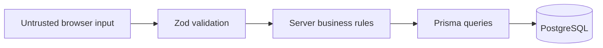

| Boundary | Rule |
| --- | --- |
| Browser to server | Treat all form and URL values as untrusted |
| Server actions | Parse unknown input with Zod |
| Server to database | Use Prisma and explicit field selections |
| Database credentials | Store only in environment configuration |
| User-facing errors | Return stable messages without internal details |
| Runtime logs | Redact configured sensitive fields |
| Audit metadata | Store only relevant structured domain information |

Authentication is not enabled in the assignment version. The application must
therefore be treated as a single-workspace demonstration until route protection
and authorization are added.

## 3. Logical application layers

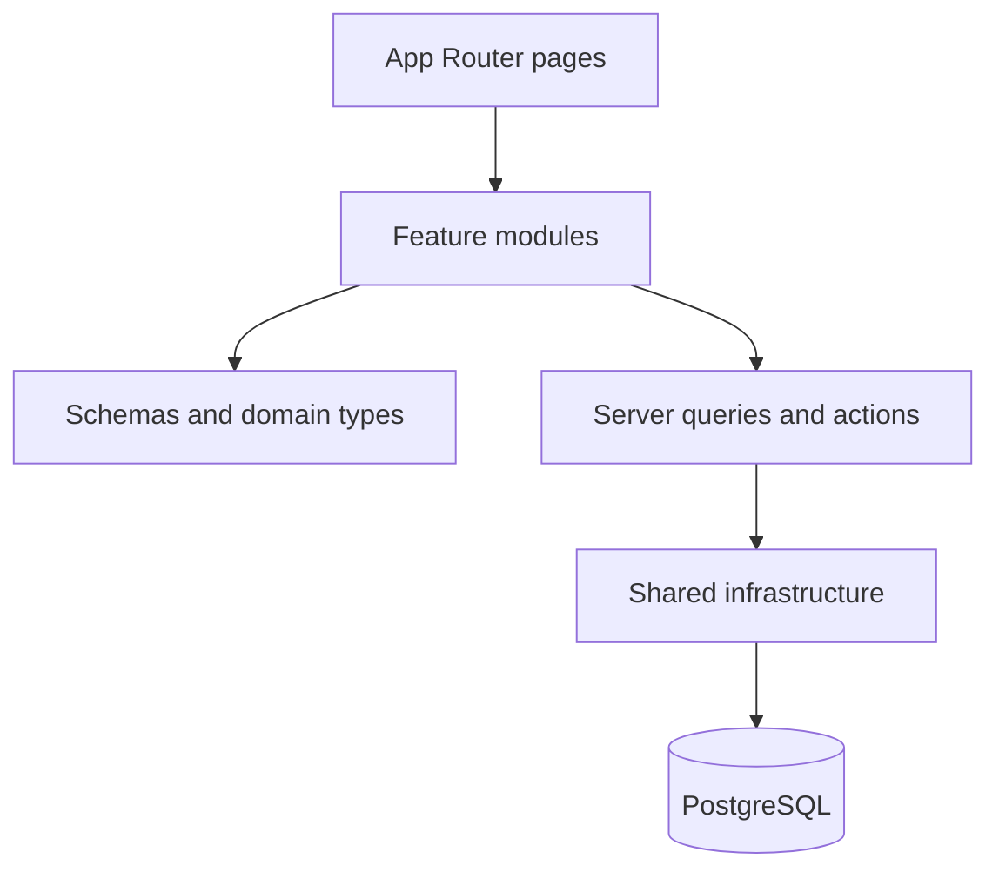

### App Router pages

App Router pages are responsible for:

- route composition;
- route metadata;
- dynamic rendering configuration;
- loading states;
- awaiting route and search parameters;
- invoking feature queries;
- rendering not-found states;
- composing feature components.

### Feature modules

Each feature owns its:

- components;
- Zod schemas;
- server queries;
- server actions;
- domain types;
- unit tests;
- component tests.

The main feature modules are:

```text
features/
  activity/
  candidates/
  dashboard/
  interviews/
  reports/
```

### Shared infrastructure

Shared infrastructure includes:

```text
lib/
  audit/
  db/
  logging/
```

Responsibilities include:

- Prisma client lifecycle;
- Neon database adapter;
- structured Pino configuration;
- audit event vocabulary;
- best-effort audit persistence.

### Content layer

Static UI text and enum labels live in typed TypeScript objects under
`content/`.

This avoids hardcoded product text across components and makes wording
consistent and maintainable.

## 4. Relational data model

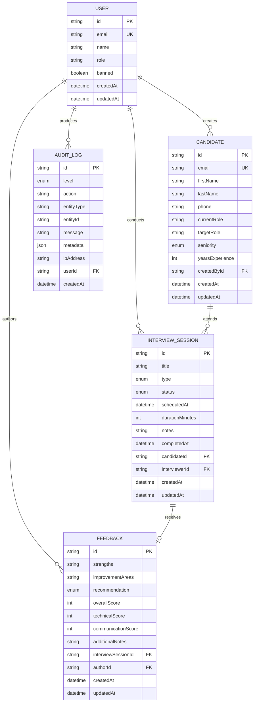

The authentication-ready portion of the schema additionally contains:

- `Session`;
- `Account`;
- `Verification`.

These models are not active until an authentication provider is configured.

## 5. Data relationships

### User and Candidate

A user can create multiple candidates.

`Candidate.createdById` is optional. If the referenced user is removed, the
candidate remains and the creator reference becomes `null`.

### Candidate and InterviewSession

A candidate can participate in multiple interviews.

Every interview must belong to one candidate.

Candidate deletion is restricted while interview sessions still reference that
candidate.

### User and InterviewSession

A user can conduct multiple interviews.

`InterviewSession.interviewerId` is optional. Removing a user does not remove
interview history.

### InterviewSession and Feedback

An interview can contain zero or one feedback record.

`Feedback.interviewSessionId` is unique, which enforces one structured feedback
record per interview.

When an interview is deleted, its feedback is deleted through cascade behavior.

### User and Feedback

A user can author multiple feedback records.

The author is optional. Removing a user preserves the feedback while setting
the author reference to `null`.

### User and AuditLog

A user can be associated with multiple audit events.

The user reference is optional so system events and historical records can
exist without an active user.

## 6. Database indexes

Indexes support the application's main access patterns.

### Candidate indexes

- creator;
- creation date.

### Interview indexes

- candidate;
- interviewer;
- status;
- type;
- scheduled date;
- candidate and status combination.

### Feedback indexes

- author;
- recommendation;
- creation date.

### Audit indexes

- user;
- level;
- entity type and entity identifier;
- creation date.

These indexes support list queries, filters, reporting, and chronological
activity views.

## 7. Read flow

Collection routes use URL parameters as the source of truth for:

- query;
- filter;
- sort field;
- sort direction;
- page number.

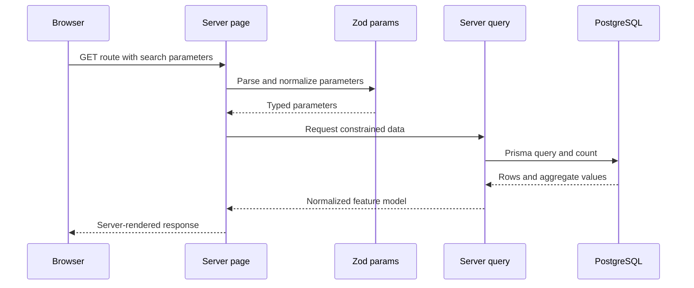

### Read flow properties

- Invalid query parameters receive constrained defaults.
- Page size is controlled by the server.
- Prisma selections restrict the fields returned by the database.
- Database records are normalized into feature-specific types.
- Search and filter state survives refresh.
- Collection views are shareable through their URL.
- Browser back and forward navigation work predictably.

## 8. Mutation flow

Candidate creation, interview creation, completion, and feedback submission use
a common server mutation pattern.

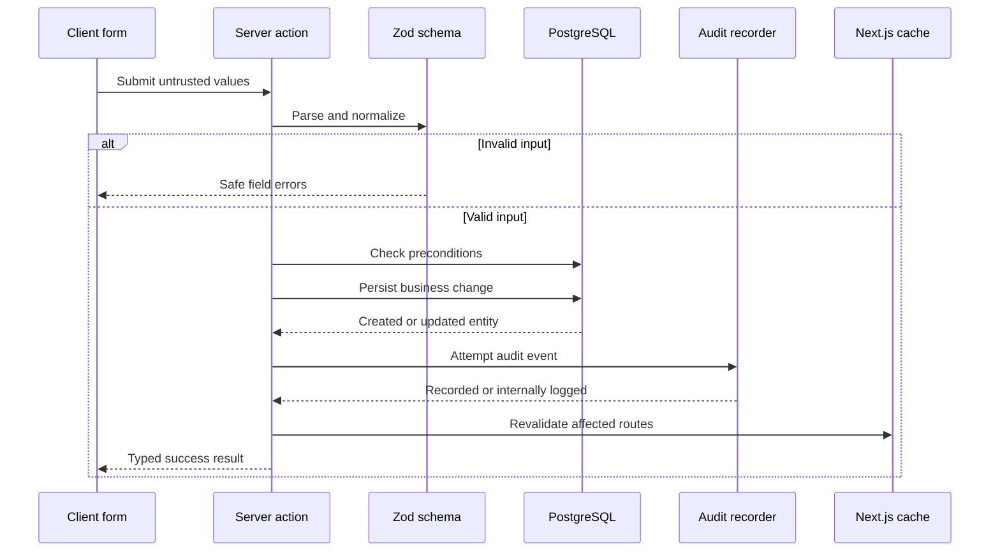

### Mutation result contracts

Server actions return discriminated unions.

Successful result:

```ts
{
  success: true;
  entityId: string;
}
```

Failed result:

```ts
{
  success: false;
  message: string;
  fieldErrors?: Record<string, string[]>;
}
```

The exact entity identifier differs by action.

This contract allows the client to:

- distinguish success from failure;
- map errors to individual controls;
- display a general server error;
- navigate or refresh after success.

## 9. Business preconditions

### Candidate creation

- Form input must be valid.
- Candidate email must satisfy schema rules.
- Persistence errors return a safe message.

### Interview creation

- Form input must be valid.
- The selected candidate must still exist.
- The scheduled date must be valid.
- Duration must be within the accepted range.
- The interview type must be supported.

### Interview completion

- The interview must still exist.
- Cancelled interviews cannot be completed.
- Already completed interviews return an idempotent success.
- A completion timestamp is stored.

### Feedback creation

- Form input must be valid.
- The interview must still exist.
- The interview must be completed.
- Feedback must not already exist.
- Scores must be whole numbers between 1 and 5.
- Optional scores and notes are normalized.

## 10. Validation architecture

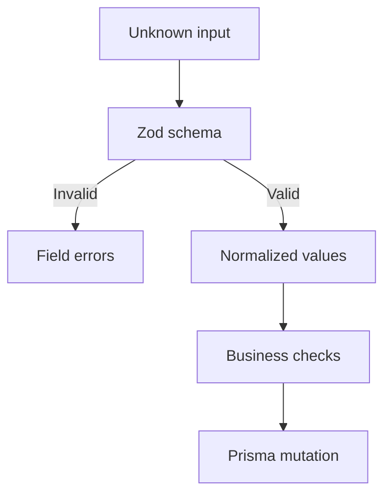

Validation occurs at two levels.

### Client validation

React Hook Form and Zod provide immediate feedback.

This improves usability but is not treated as a security boundary.

### Server validation

Every server action validates the input again.

Server validation protects against:

- bypassed client code;
- manually constructed requests;
- stale form state;
- unsupported enum values;
- invalid dates;
- invalid numeric values;
- oversized text fields.

## 11. Error handling

Unexpected errors are separated from expected business failures.

### Expected failures

Examples:

- invalid input;
- missing candidate;
- missing interview;
- cancelled interview;
- incomplete interview;
- duplicate feedback.

These failures return stable content-defined messages and optional field errors.

### Unexpected failures

Examples:

- database connection failure;
- Prisma persistence failure;
- infrastructure exception.

These failures:

1. are logged through Pino;
2. include internal operational context;
3. return a safe generic message;
4. do not expose stack traces or credentials.

## 12. Audit architecture

Audit records represent significant domain events rather than every runtime log
line.

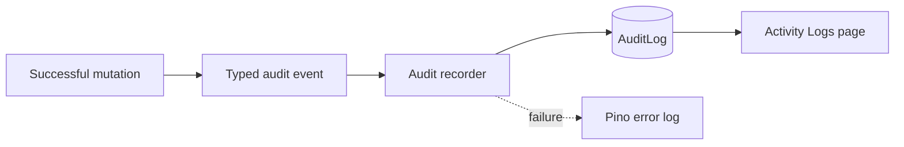

### Audit event vocabulary

The audit layer defines centralized action and entity identifiers.

This avoids arbitrary action strings being repeated across server functions.

Events include:

- candidate created;
- interview created;
- interview completed;
- feedback submitted.

### Best-effort behavior

Audit persistence is intentionally best effort.

If the primary business operation succeeds but audit persistence fails:

- the primary operation remains successful;
- the audit failure is logged;
- the user is not told the already completed operation failed.

### Production alternative

A stricter production system could implement:

1. a database transaction;
2. an outbox record;
3. an asynchronous worker;
4. retry behavior;
5. dead-letter handling;
6. delivery monitoring.

This would provide guaranteed audit delivery without coupling user-visible
success to an auxiliary projection.

## 13. Activity log flow

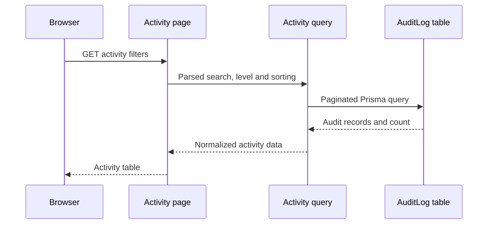

The Activity page supports:

- full-text-style search across relevant fields;
- level filtering;
- level and creation-date sorting;
- pagination;
- explicit empty states.

## 14. Reporting architecture

Reports are calculated from current source tables.

### Interview metrics

Calculated from `InterviewSession`:

- total interviews;
- completed interviews;
- completion rate;
- status distribution;
- type distribution.

### Feedback metrics

Calculated from `Feedback`:

- submitted feedback count;
- feedback coverage;
- recommendation distribution;
- average overall score;
- average technical score;
- average communication score.

### Empty data behavior

The server query normalizes:

- zero totals;
- missing averages;
- absent optional scores;
- empty distributions.

This prevents presentation components from having to infer database semantics.

### Scaling reports

For the current assignment dataset, live aggregates are simple and accurate.

For a larger production system, possible improvements include:

- cached aggregates;
- materialized PostgreSQL views;
- scheduled report snapshots;
- analytics replicas;
- a reporting warehouse.

## 15. Runtime logging

Pino produces structured JSON records.

Operational records can include:

- service name;
- environment;
- action;
- duration;
- entity identifier;
- result count;
- pagination information;
- serialized errors.

Sensitive fields are redacted, including:

- passwords;
- tokens;
- authorization headers;
- cookies;
- email addresses;
- phone numbers.

Operational logs and business audit events are kept separate because they have
different audiences and retention requirements.

## 16. Health monitoring

The health endpoint is:

```text
GET /api/health
```

It executes a lightweight database query.

Successful behavior:

- HTTP `200`;
- application status `ok`;
- database status `connected`.

Failure behavior:

- HTTP `503`;
- application status `error`;
- database status `unavailable`;
- internal failure recorded through Pino.

The production endpoint is:

```text
https://interview-track-ten.vercel.app/api/health
```

## 17. Deployment topology

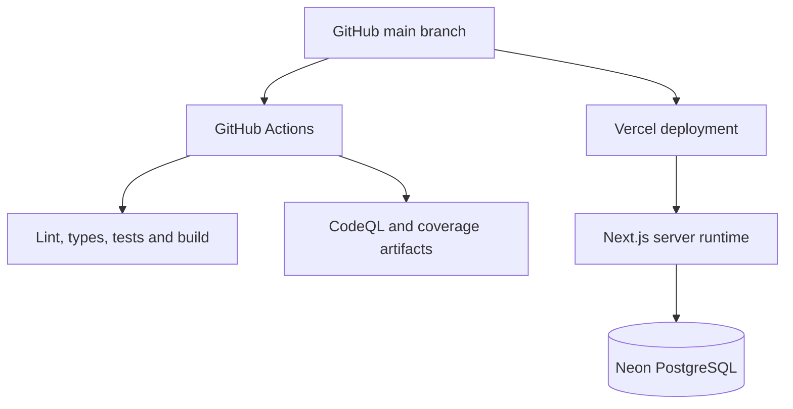

### Deployment sequence

1. Code is pushed to GitHub.
2. GitHub Actions installs dependencies using the lockfile.
3. Prisma validates the schema.
4. ESLint checks code quality.
5. TypeScript verifies types.
6. Vitest executes tests and enforces coverage.
7. Next.js creates an optimized production build.
8. CodeQL performs static security analysis.
9. Vercel builds and deploys the connected branch.
10. The application connects to Neon using environment variables.

### Production services

| Service | Responsibility |
| --- | --- |
| GitHub | Source control |
| GitHub Actions | CI validation |
| CodeQL | Static security analysis |
| Vercel | Next.js build, routing and runtime |
| Neon | PostgreSQL persistence |

### Environment configuration

Runtime connection:

```text
DATABASE_URL
```

Migration connection:

```text
DIRECT_URL
```

Production credentials belong in Vercel environment settings and must never be
committed.

### Migration strategy

Committed migrations are applied using:

```bash
pnpm exec prisma migrate deploy
```

Migrations are not run implicitly every time the application starts. This
avoids unexpected production schema changes during runtime startup.

## 18. Continuous integration

The main CI workflow runs on:

- pushes to `main`;
- pull requests to `main`;
- manual execution.

The workflow checks:

1. lockfile integrity;
2. Prisma schema validity;
3. ESLint;
4. TypeScript;
5. Vitest;
6. coverage thresholds;
7. optimized Next.js build.

Coverage output is uploaded as a short-retention artifact.

CodeQL runs:

- on pushes;
- on pull requests;
- manually;
- weekly.

## 19. Test boundaries

### Schema tests

Validate:

- valid parsing;
- optional value normalization;
- string limits;
- score limits;
- integer requirements;
- enum rejection;
- date validation.

### Server tests

Validate:

- Prisma query input;
- normalized output;
- business failures;
- successful persistence;
- audit integration;
- route revalidation;
- safe exception handling;
- structured logging.

### Component tests

Validate:

- accessible rendering;
- form interaction;
- validation errors;
- pending states;
- server error mapping;
- navigation;
- sorting;
- filtering;
- pagination;
- empty states;
- chart data mapping.

### Infrastructure tests

Validate:

- Prisma singleton behavior;
- logger configuration;
- audit recorder behavior.

## 20. Security posture

Implemented protections:

- server-side validation;
- parameterized database access through Prisma;
- server-only credentials;
- constrained database selections;
- safe user-facing errors;
- structured log redaction;
- relational constraints;
- dependency lockfile;
- automated CI;
- CodeQL analysis.

### Current security boundary

Authentication and authorization are not active.

Before real organizational use:

1. configure Better Auth;
2. protect the dashboard route group;
3. authorize every server action;
4. derive user identifiers from the session;
5. restrict Activity Logs to administrators;
6. capture trusted request context;
7. review CSRF and session configuration;
8. introduce rate limiting;
9. add security headers;
10. isolate tenant data if multiple organizations are supported.

## 21. Authentication-ready design

The database contains:

- User;
- Session;
- Account;
- Verification.

Domain tables already contain optional actor relationships:

- `Candidate.createdById`;
- `InterviewSession.interviewerId`;
- `Feedback.authorId`;
- `AuditLog.userId`.

When authentication is enabled, these fields can be populated from the
authenticated session without redesigning the core domain model.

Recommended flow:

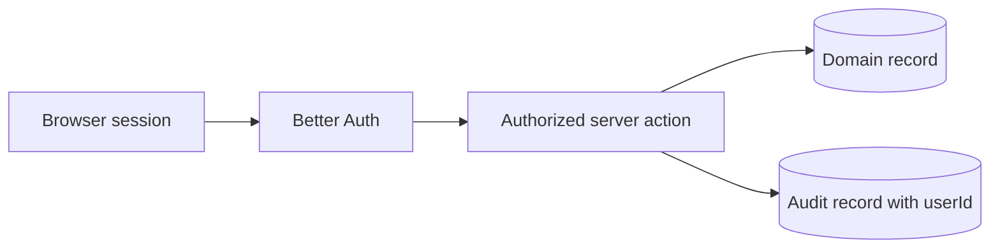

## 22. Scalability considerations

| Pressure | Current approach | Future option |
| --- | --- | --- |
| Larger candidate lists | Indexed offset pagination | Cursor pagination |
| Larger interview lists | Server filtering and indexes | Cursor pagination and query tuning |
| Expensive reports | Live aggregates | Cache or materialized views |
| Audit reliability | Best effort | Transactional outbox |
| Notifications | Not implemented | Queue and background worker |
| Multiple users | Authentication-ready schema | Better Auth and RBAC |
| Multiple organizations | Single workspace | Tenant isolation |
| Runtime diagnosis | Structured logs | Tracing and error monitoring |

## 23. Key trade-offs

### Server actions instead of a separate REST API

Server actions reduce transport boilerplate and integrate naturally with the
App Router form flows.

A public API, mobile client, or external integration would justify a separate
versioned REST or GraphQL boundary.

### Live report calculations instead of stored snapshots

Live calculations keep reports consistent with current data and avoid
reconciliation logic.

The trade-off is increased query cost as the dataset grows.

### Best-effort audit persistence instead of atomic delivery

Best-effort persistence prevents auxiliary audit failures from incorrectly
failing an already completed business operation.

The trade-off is that an audit record can be lost if persistence fails.

### Single-workspace MVP instead of incomplete authentication

Authentication was not an explicit assignment requirement.

The schema was kept authentication-ready while implementation effort focused on
completing and testing the requested interview workflow.

### URL state instead of hidden table state

URL-driven filtering and pagination improve navigation and shareability.

The trade-off is additional search parameter parsing and route replacement
logic.

## 24. Future architecture improvements

Recommended production improvements:

1. Better Auth integration.
2. Role-based access control.
3. Administrator-only Activity Logs.
4. Authenticated audit actor information.
5. Request correlation identifiers.
6. Trusted IP address capture.
7. Transactional audit outbox.
8. Interview state machine.
9. Background reminder jobs.
10. Email and calendar integration.
11. Configurable workspace time zone.
12. Report caching.
13. Materialized reporting views.
14. CSV and PDF export.
15. Playwright end-to-end tests.
16. Automated accessibility checks.
17. Error monitoring.
18. OpenTelemetry tracing.
19. Multi-tenant data isolation.
20. Backup and recovery procedures.

## 25. Architecture summary

Interview Track uses a deliberately straightforward architecture:

- Next.js provides the web and server runtime.
- React Server Components perform page-level reads.
- Client Components handle interaction.
- Server actions implement mutations.
- Zod validates all external input.
- Prisma provides typed relational access.
- Neon PostgreSQL stores domain and audit data.
- Pino provides operational visibility.
- AuditLog provides persistent business history.
- Vitest verifies schemas, server behavior, components, and infrastructure.
- GitHub Actions and CodeQL protect the main branch.
- Vercel provides production hosting.

This architecture is intentionally simple enough for the assignment while
keeping clear extension points for authentication, authorization, guaranteed
auditing, notifications, advanced reporting, and multi-tenant operation.